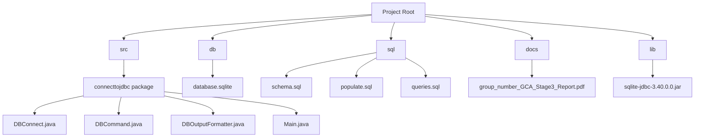

# SQLite Integration Guide for Database Systems Project

## Table of Contents
- [Introduction](#introduction)
- [Project Requirements](#project-requirements)
- [Setting Up SQLite](#setting-up-sqlite)
- [NetBeans Integration Guide](#netbeans-integration-guide)
- [VSCode Integration Guide](#vscode-integration-guide)
- [Working with SQLite in Java](#working-with-sqlite-in-java)
- [Common Issues and Solutions](#common-issues-and-solutions)
- [Project Structure Overview](#project-structure-overview)
- [Database Conversion Guide](#database-conversion-guide)

## Introduction

This guide provides instructions for integrating SQLite with your Java application for Stage 3 of the Database Systems Project. It includes setup instructions for both NetBeans and VSCode environments.

## Project Requirements

Stage 3 requires you to:
1. Implement your final 3NF schema in SQLite
2. Develop 10 advanced SQL queries
3. Build a Java application using JDBC to execute those queries
4. Document everything in a comprehensive report

## Setting Up SQLite

### SQLite JDBC Driver

Before connecting to SQLite, you need to add the SQLite JDBC driver to your project:

1. **Download the SQLite JDBC Driver**
   - Visit: [https://github.com/xerial/sqlite-jdbc/releases](https://github.com/xerial/sqlite-jdbc/releases)
   - Download the latest JAR file (e.g., `sqlite-jdbc-3.40.0.0.jar`)

2. **Project Setup**
   - Create a `lib` folder in your project
   - Place the downloaded JAR file in the `lib` folder

## NetBeans Integration Guide

### Adding the Driver to NetBeans

1. Right-click on your project in the Projects window
2. Select "Properties"
3. Go to "Libraries" > "Compile" tab
4. Click "Add JAR/Folder" and locate the downloaded SQLite JDBC driver JAR file
5. Click "Open" and then "OK"

### Testing in NetBeans

To verify your SQLite connection in NetBeans:

1. Create a test method that attempts to connect to your database
2. Run in debug mode to check for any connection errors
3. Use the `displayDatabaseSchema()` method in `DBCommand.java` to verify schema

## VSCode Integration Guide

### Required Extensions

Install the following VSCode extensions:

1. **Extension Pack for Java** by Microsoft
2. **SQLite** by alexcvzz
3. **SQLite Viewer** by Florian Klampfer

### Adding the Driver to VSCode

1. Create a `lib` folder in your project root
2. Copy the downloaded JAR file to the `lib` folder
3. Right-click on the JAR file in VSCode Explorer
4. Select "Add to Java Build Path"

### Using SQLite Viewer in VSCode

1. Open the SQLite Viewer extension
2. Click "Open Database"
3. Navigate to your `database.sqlite` file
4. Click on the file to open it
5. Click on "New Query" to write and execute SQL queries directly


## Working with SQLite in Java

### Connection Best Practices

When connecting to SQLite, follow these best practices:

1. **Check for driver availability before connecting**
   ```java
   if (!DBConnect.isSQLiteDriverAvailable()) {
       System.err.println("SQLite JDBC driver not available.");
       return;
   }
   ```

2. **Use both relative and absolute paths**
   ```java
   // Try relative path first
   conn = DBConnect.connect(dbFilePath);
   if (conn == null) {
       // Fall back to absolute path
       conn = DBConnect.connect(DBConnect.getAbsolutePath(dbFilePath));
   }
   ```

3. **Always close connections in a finally block**
   ```java
   try {
       // Execute queries
   } finally {
       DBConnect.disconnect(conn);
   }
   ```

### Using Prepared Statements

For parameterized queries, use prepared statements for better security and performance:

```java
String query = "SELECT * FROM Games WHERE Genre = ? AND ReleaseDate > ?";
Object[] params = {"Action", "2020-01-01"};
ResultSet resultSet = DBCommand.executePreparedQuery(conn, query, params);
```

### Displaying Query Results

The `DBOutputFormatter` class provides methods for displaying different types of query results:

- `showAllGames()` - For displaying games table data
- `showAllScores()` - For displaying player scores data
- `showGenericQueryResult()` - For generic query results
- `showAggregationResults()` - For GROUP BY queries
- `showSubqueryResults()` - For subquery results
- `showCaseStatementResults()` - For queries with CASE statements
- `showCTEResults()` - For Common Table Expression queries
- `showViewResults()` - For queries against views

## Common Issues and Solutions

### Database File Not Found

If you get "Database file not found" errors:

1. Check the file path in your code
2. Print the working directory to debug path issues:
   ```java
   System.out.println("Working directory: " + System.getProperty("user.dir"));
   ```
3. Try using an absolute path

### Driver Not Found

If you get "ClassNotFoundException: org.sqlite.JDBC":

1. Verify the SQLite JDBC JAR is in your project's classpath
2. Check if the JAR file is corrupted (try downloading again)

### SQL Syntax Errors

SQLite has some syntax differences from MySQL:

1. SQLite doesn't support all MySQL functions
2. Date formats may be different
3. AUTO_INCREMENT is replaced with AUTOINCREMENT in SQLite

## Project Structure Overview

For Stage 3, maintain this structure:



## Database Conversion Guide

### Converting MySQL to SQLite

After creating your database in PHPMyAdmin:

1. **Export from PHPMyAdmin**
   - Open your database in PHPMyAdmin
   - Click on "Export" tab
   - Choose "Quick" export method
   - Select "SQL" format
   - Click "Export" and download the `.sql` file

2. **Convert to SQLite**
   - Use an online converter: [https://www.rebasedata.com/convert-mysql-to-sqlite-online](https://www.rebasedata.com/convert-mysql-to-sqlite-online)
   - Upload your MySQL `.sql` file
   - Download the converted `.sqlite` file

3. **Test the Converted Database**
   - Use DB Browser for SQLite or VSCode SQLite Viewer to inspect the database
   - Verify all tables and data are correctly converted
   - Run a few test queries to ensure functionality

### SQLite Data Type Considerations

Be aware of SQLite's dynamic typing system:
- SQLite uses a type affinity system rather than strict data types
- TEXT in SQLite can store dates (use proper formatting in queries)
- INTEGER PRIMARY KEY columns automatically become rowid aliases
